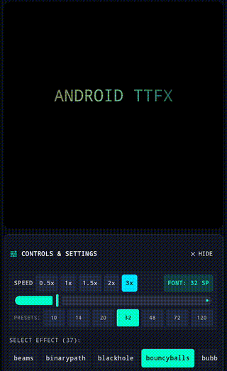
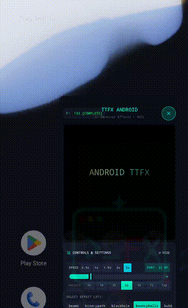

# TTFX for Android (`ttfx4android`)

[](https://kotlinlang.org)
[](https://developer.android.com)
[](https://developer.android.com/jetpack/compose)
[-orange.svg)](https://github.com/julianbruno/ttfx4android)
[](LICENSE)

> [!IMPORTANT]
> **Project Status: Work in Progress (WIP)**  
> This project is currently under active development. The core simulation engine, all 37 animation effects, Jetpack Compose canvas renderer, and AGSL post-processing shaders are fully operational and pass deterministic parity tests. APIs, packaging, and showcase UI features are actively evolving.

---

## Executive Summary

**TTFX for Android (`ttfx4android`)** brings the expressive visual power of terminal-based character animation into modern Android applications. It provides a native, hardware-accelerated implementation of all **37 terminal text visual effects** originally pioneered in terminal emulators, now rendered natively inside **Jetpack Compose** at 60+ FPS.

### At a Glance:
- **What It Is**: A high-performance Kotlin animation engine that simulates complex particle physics, cryptographic reveals, matrix rain, geometric unfurling, and analog cathode-ray sweeps on a 2D character canvas.
- **How It Works**: A decoupled **pure Kotlin JVM simulation engine** (`:core`, `:effects`) drives cell coordinate and color transitions with mathematical determinism, while a dedicated **Jetpack Compose renderer** (`:ui-compose`) maps the matrix onto Android's graphic pipeline with optional **AGSL hardware shaders** (`:app`).
- **Why It Matters**: Terminal text animations are traditionally confined to CLI tools (via ANSI escape sequences) or desktop platforms. `ttfx4android` makes these effects first-class citizens in mobile apps—perfect for cyberpunk/hacker UIs, dynamic splash screens, retro gaming HUDs, and interactive typography.

---

## Sibling Project: `ttfx` vs. `ttfx4android`

This repository is the dedicated Android sibling of [**`julianbruno/ttfx`**](https://github.com/julianbruno/ttfx). 

Both repositories share the same creative DNA—originally inspired by Chris R. Bilger's Python [`terminaltexteffects`](https://github.com/ChrisBuilds/terminaltexteffects)—but are tailored for fundamentally different platform ecosystems and rendering backends:

| Feature / Dimension | Sibling Repository ([`ttfx`](https://github.com/julianbruno/ttfx)) | This Repository ([`ttfx4android`](https://github.com/julianbruno/ttfx4android)) |
| :--- | :--- | :--- |
| **Primary Platforms** | macOS, iOS, iPadOS, Terminal / CLI | Android (Phone, Tablet, Foldable, Emulator) |
| **Primary Languages** | Swift (Swift 6) & Rust | 100% Kotlin (Kotlin 2.1.10) |
| **Rendering Backend** | Apple Metal compute/fragment shaders (`.metal`) & ANSI stdout | Jetpack Compose `Canvas` & Android Graphics Shading Language (**AGSL**) |
| **Post-Processing** | Metal Shading Language (`MSL`) GPU pipelines | Android 13+ `RuntimeShader` via `RenderEffect` (CRT, Bloom, Chromatic Aberration) |
| **Package / Build** | Swift Package Manager (`Package.swift`) & Cargo (`Cargo.toml`) | Multi-module Gradle 8.14.5 + Android Gradle Plugin 8.13.2 (`.kts`) |
| **Display Model** | Terminal PTY / Terminal window / Metal View | Jetpack Compose Composable hierarchy (`TTFXCanvas`) |
| **Core Dependency** | Swift Standard Library / Rust std / MetalKit | Pure Kotlin JVM (Zero Android dependencies in `:core` and `:effects`) |
| **Effect Parity** | 37 distinct terminal effects (Reference implementation) | **37 distinct terminal effects (100% mathematical parity)** |
| **PRNG Engine** | `Xoshiro256++` (64-bit deterministic) | `Xoshiro256PlusPlus` (64-bit deterministic parity) |
| **Verification** | Recorded `.frames` golden test suite | Automated JUnit 5 golden parity tests against `.frames` fixtures |

---

## Visual Parity: Android (Compose + AGSL) vs. Original Swift (Metal)

Below is a side-by-side comparison of the animation engine running on **Android** (Jetpack Compose with hardware-accelerated AGSL CRT scanline shader) alongside the original **Swift (Apple Metal)** reference from [`julianbruno/ttfx`](https://github.com/julianbruno/ttfx):

### 1. `fireworks` Effect

| Android (Jetpack Compose + AGSL) | Original Swift (Apple Metal) |
| :---: | :---: |
|  |  |
| **`ttfx4android`**: Compose Canvas + AGSL CRT Shader | **`ttfx`**: Metal Compute/Fragment Shaders |
| [Download Android MP4](docs/media/android_fireworks.mp4) | [Download Swift MP4](https://raw.githubusercontent.com/julianbruno/ttfx/main/docs/swift-port/comparisons/fireworks.mp4) |

### 2. Boot Splash Sequence (`decrypt` Effect)

The Android application showcases an animated boot sequence powered by the `decrypt` effect:

| Android Boot Splash Sequence (`decrypt`) | Original Swift Reference (`decrypt`) |
| :---: | :---: |
|  |  |
| Native Compose `SplashScreen` with CRT Glow | Metal Shading Reference |
| [Download Android MP4](docs/media/android_splash.mp4) | [Download Swift MP4](https://raw.githubusercontent.com/julianbruno/ttfx/main/docs/swift-port/comparisons/decrypt.mp4) |

*For visual previews and video comparisons across all 37 effects, see the [**Complete Effects Catalog**](docs/EFFECTS.md).*

---

## Key Features

- **🚀 Complete 37-Effect Library**: Full catalog of typographic, particle, geometric, and atmospheric effects (see [Effects Catalog](docs/EFFECTS.md)).
- **📱 Jetpack Compose Native**: Drop-in `TTFXCanvas` composable with automatic coroutine lifecycle handling and delta-time updates.
- **✨ AGSL Hardware Shaders**: Post-processing effects on Android 13+ (API 33+):
  - **CRT Scanlines**: Phosphor line grid with ambient vignette.
  - **Bloom Glow**: Gaussian-approximated neon glow on active glyphs.
  - **Chromatic Aberration**: Analog RGB color-channel fringing.
  - **CRT Curvature**: Barrel monitor geometry distortion.
- **🎛️ Interactive Cyberpunk Showcase App**:
  - Full-screen terminal animation canvas with live preview.
  - Speed multiplier pills (`0.5x`, `1x`, `1.5x`, `2x`, `3x`).
  - Font size slider (`8sp` to `120sp`) with quick preset chips.
  - Instant effect selector across all 37 effects.
  - Live text prompt modification with one-tap replay.
  - Responsive, scrollable controls panel with safe-drawing insets.
  - Native Android 12+ SplashScreen with custom cyberpunk adaptive vector icon.

---

## Technology Stack

| Layer | Specifications |
| :--- | :--- |
| **Language & Toolchain** | Kotlin 2.1.10, JDK 21 (Gradle Toolchain), Gradle 8.14.5 |
| **Android Target** | Target SDK 35 (Android 15), Min SDK 24 (Android 7.0) |
| **UI Framework** | Jetpack Compose (BOM 2024.12.01), Material 3, Material Icons Extended |
| **Rendering Pipeline** | Compose `Canvas`, Android `NativeCanvas.drawText`, Android `RenderEffect`, AGSL |
| **Modular Architecture** | Multi-module Gradle (`:core`, `:effects`, `:ui-compose`, `:app`) |
| **Test Framework** | JUnit 5 (`junit-jupiter`), Kotlin Test, Headless deterministic suites |

---

## Module Architecture

```
ttfx4android/
├── core/                # Pure Kotlin JVM: Canvas, Frame, Cell, Color, Easing, PRNG (Zero Android SDK deps)
├── effects/             # 37 Effect engines + EffectRegistry (Pure Kotlin JVM)
├── ui-compose/          # Jetpack Compose renderer (TTFXCanvas, TTFXAnimationController)
└── app/                 # Interactive Android showcase application with AGSL shaders & cyberpunk UI
```

---

## Quick Start in Jetpack Compose

### 1. Add Dependency (JitPack)
In your root `settings.gradle.kts`:
```kotlin
dependencyResolutionManagement {
    repositories {
        google()
        mavenCentral()
        maven { url = uri("https://jitpack.io") }
    }
}
```

In your module's `build.gradle.kts`:
```kotlin
dependencies {
    // Complete Compose UI + Effects + Core
    implementation("com.github.julianbruno.ttfx4android:ui-compose:1.0.0")
}
```

*(You can also publish locally with `./gradlew publishToMavenLocal`. See [Installation Guide](docs/INSTALLATION.md)).*

### 2. Render Animation in Compose
```kotlin
val effectName = "fireworks"
val text = "HELLO WORLD"
val columns = 40
val rows = 15

val controller = remember(effectName, text) {
    val canvas = Canvas(columns, rows)
    val ingested = canvas.ingest(text, anchor = "c")
    val config = EffectConfiguration(text = text, seed = 42uL)

    TTFXAnimationController(columns, rows) {
        EffectRegistry.create(effectName, config, canvas, ingested, 42uL)
            ?: error("Effect $effectName not registered")
    }
}

// Embed into your Compose layout
TTFXCanvas(
    controller = controller,
    modifier = Modifier
        .fillMaxWidth()
        .height(300.dp),
    fps = 30,
    fontSizeSp = 16f
)
```

---

## Detailed Documentation

- 📖 [**Installation & Setup Guide**](docs/INSTALLATION.md): Environment requirements, building APKs, and module dependencies.
- 🏛️ [**Architecture & Technical Design**](docs/ARCHITECTURE.md): Multi-module design, rendering pipeline, and AGSL shader integration.
- 🎨 [**Effects Catalog**](docs/EFFECTS.md): Comprehensive inventory of all 37 effects with visual descriptions.

---

## License

This project is licensed under the MIT License - see the [LICENSE](LICENSE) file for details.
